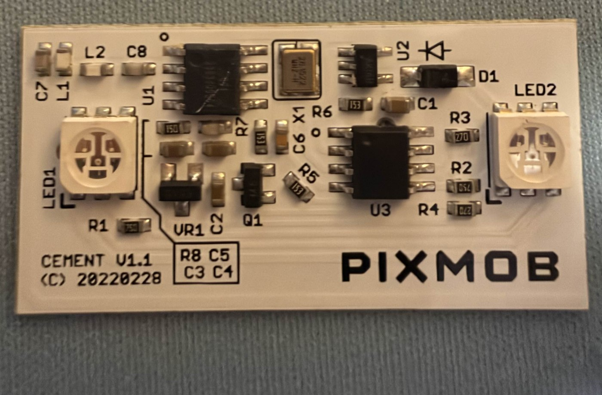
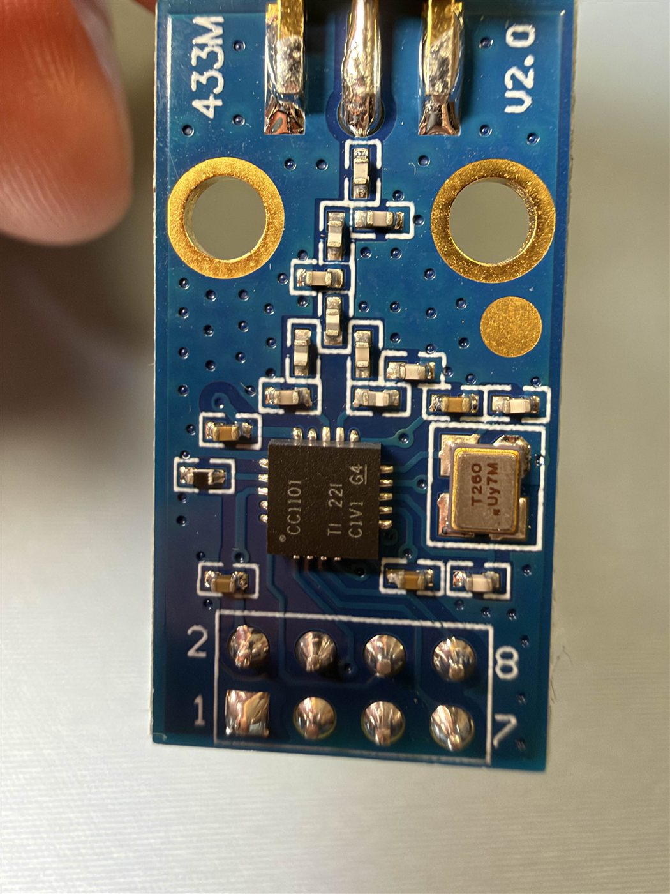
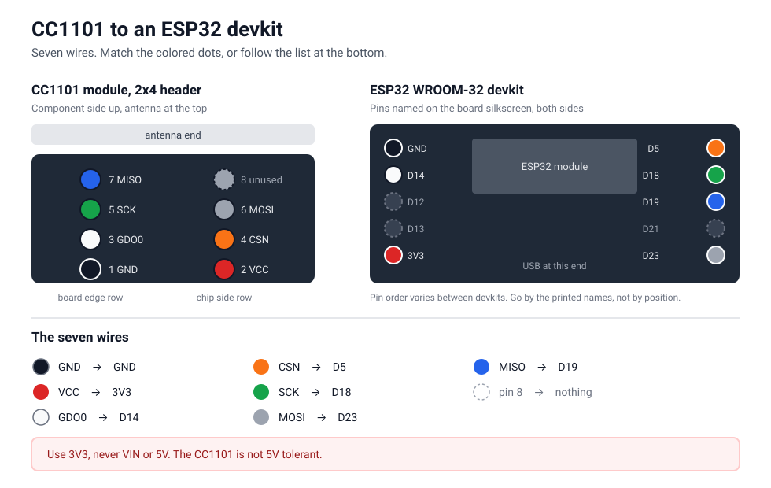
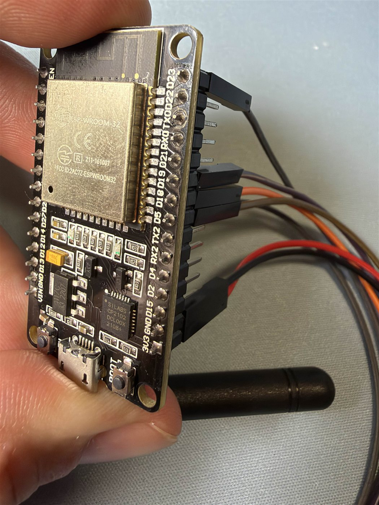
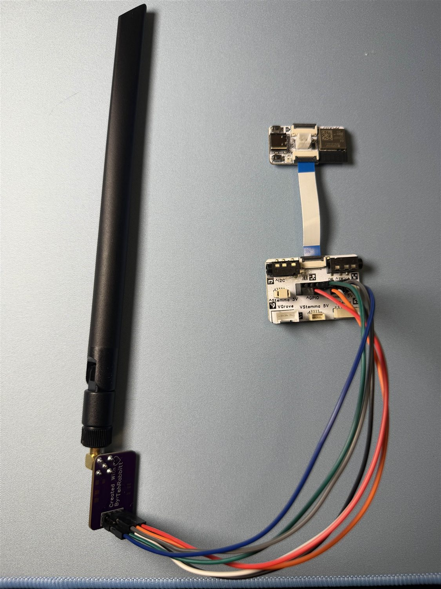
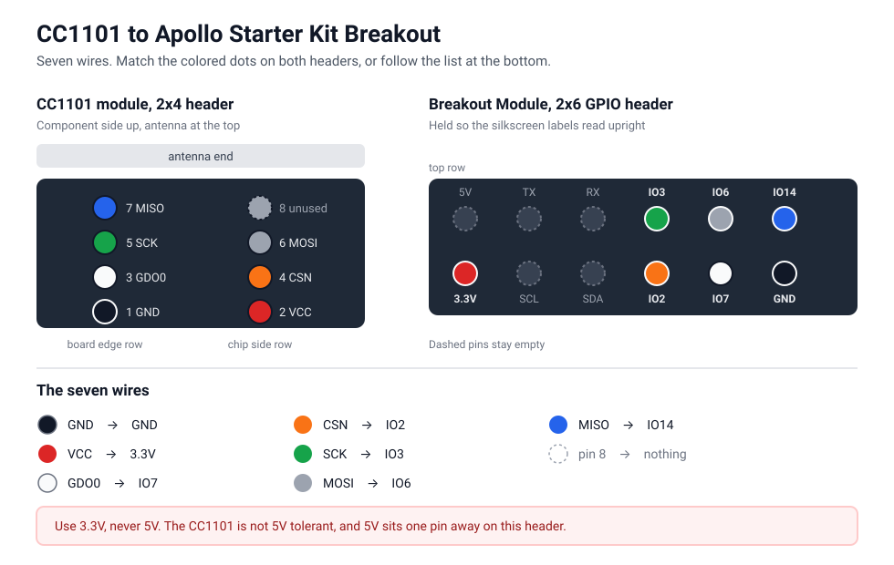
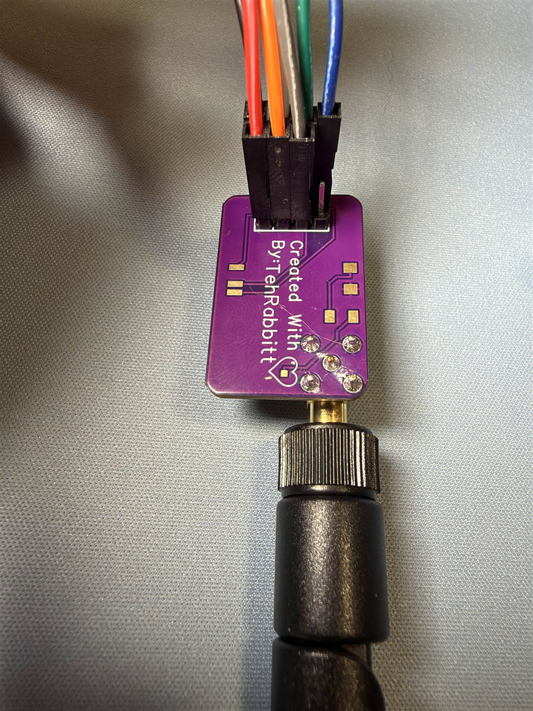
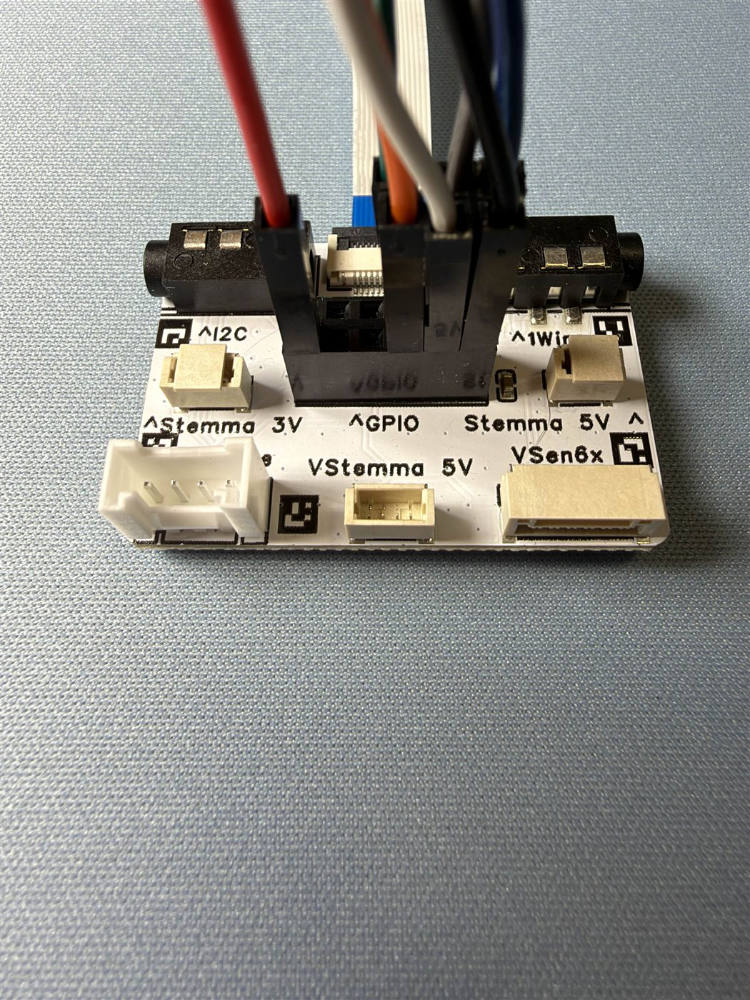

# esphome-pixmob

Control PixMob RF wristbands (the "waveband" generation, Cement family) from
ESPHome. The band shows up in Home Assistant as a normal RGB light: color
picker, transitions, effects, automations. A background refresh keeps the
band lit for as long as the light is on, so you get steady colors instead of
the 3.4 second bursts the protocol gives you out of the box.

## Check your band first

This only works on the **RF** PixMob bands, the ones with a sub-GHz radio
receiver inside. Most PixMob bands handed out at concerts are **infrared**
instead, and they will never respond to this no matter how the radio is
configured. Open the wristband and look at the board before buying any
hardware.



You want a board like this one:

- **"CEMENT" printed on the silkscreen.** This is the Cement family, and it
  is the generation this component was built and tested against.
- **No IR receiver.** IR bands have a clear or dark domed photodiode facing
  out of the board. If you see one, this component is the wrong tool.
- Runs on **CR2032** coin cells.

If your band is IR, the work you want is
[pixmob-ir-reverse-engineering](https://github.com/danielweidman/pixmob-ir-reverse-engineering),
which is a different protocol on different hardware.

Bands ship regionally: 915.33 MHz in North America, 868.41 MHz in Europe.
The frequency follows where the band was used, not where you live.

## Hardware

- Any ESP32 board ESPHome supports (tested on an ESP32-C6 and a classic
  ESP32 WROOM-32 devkit)
- A CC1101 radio module built for 868/915 MHz, plus a matching antenna

Get the band right. The common 433 MHz modules use the same chip but a
different matching network, and they pay 10 to 20 dB for it at 915 MHz.
Measured with the same band and the same firmware:

| Module | Range |
| --- | --- |
| Ebyte E07-M1101D (433 MHz) | A few feet, same room |
| Rabbit-Labs 900 MHz | Whole house, through walls and between floors |

Both light the band, so a 433 module is fine for a bench test. Only the
right band gives you a device you can leave on a shelf. Listings titled
"315/433/868/915MHz" are quoting the chip datasheet, not the board, so
check the silkscreen.

Wire the CC1101's SPI pins (SCK, MOSI, MISO, CSN) plus GDO0 to free GPIOs.

This component was developed and tested with the
[Rabbit-Labs CC1101 900MHz module](https://www.tindie.com/products/tehrabbitt/rabbit-labstm-cc1101-900mhz-module/),
which has a proper 915 MHz front end and measures about +10 dBm in this
band. Its 2x4 header has no pin labels and is easy to wire backwards, so
here is the layout, verified electrically on the board this component was
built against. It follows the Ebyte E07-M1101D order, in pairs from the
power end:

| Pair (from power end) | Board-edge row | Inner row |
|---|---|---|
| 1 | GND | VCC (3.3V) |
| 2 | GDO0 | CSN |
| 3 | SCK | MOSI |
| 4 | MISO | GDO2 (unused) |

To orient yourself on any unlabeled module: GND is the edge-row pin that
has continuity to the antenna connector's shield. Never feed the module
5V, the CC1101 is not 5V tolerant.

Many CC1101 boards number the header corners on the back instead of naming
the pins. Those numbers are the E07-M1101D order above, so they are all you
need: 1 is GND, 2 is VCC, and the pairs count away from there.



Wiring on a plain ESP32 WROOM-32 devkit, matching the config in
[example.yaml](example.yaml):





| Module pin | Signal | Devkit pin |
| --- | --- | --- |
| 1 | GND | GND |
| 2 | VCC | 3V3 |
| 3 | GDO0 | D14 |
| 4 | CSN | D5 |
| 5 | SCK | D18 |
| 6 | MOSI | D23 |
| 7 | MISO | D19 |
| 8 | GDO2 | not connected |

### On an Apollo ESPHome Starter Kit

The [Breakout Module](https://wiki.apolloautomation.com/products/ESPHome-Starter-Kit/modules/apollo-breakout-module/)
brings the ESP32-C6's spare pins out to a 2x6 header, and the radio needs
exactly the five signals it has free. This is the rig the component was
developed on.





The wire colors below are the ones in the photos and the diagram, so you
can match every end against the same table.

| Module pin | Signal | Breakout header | Wire in the photos |
| --- | --- | --- | --- |
| 1 | GND | GND | black |
| 2 | VCC | 3.3V | red |
| 3 | GDO0 | IO7 | white |
| 4 | CSN | IO2 | orange |
| 5 | SCK | IO3 | green |
| 6 | MOSI | IO6 | grey |
| 7 | MISO | IO14 | blue |

Radio end, wires seated on the unlabeled 2x4 header:



Breakout end, same wires on the 2x6 GPIO header:



The header's 3.3V pin runs on the ESP32-C6's switched rail, so the config
has to hold that rail on or the radio never powers up:

```yaml
switch:
  - platform: gpio
    pin:
      number: GPIO4
      ignore_strapping_warning: true
    id: accessory_power
    restore_mode: ALWAYS_ON
    setup_priority: 2000
    internal: true
```

## Configuration

```yaml
external_components:
  - source: github://bharvey88/esphome-pixmob

spi:
  clk_pin: GPIO3
  miso_pin: GPIO14
  mosi_pin: GPIO6

cc1101:
  id: radio
  cs_pin: GPIO2
  frequency: 915.33MHz     # US band. EU bands use 868.41MHz.
  modulation_type: ASK/OOK
  output_power: 10
  packet_mode: false

remote_transmitter:
  id: tx
  pin: GPIO7               # CC1101 GDO0
  carrier_duty_percent: 100%
  rmt_symbols: 96
  non_blocking: true

light:
  - platform: pixmob
    name: "PixMob Band"
    transmitter_id: tx
    cc1101_id: radio
    gamma_correct: 1.0
```

See [example.yaml](example.yaml) for a complete config.

### Options

| Option | Default | Range | What it does |
|---|---|---|---|
| `transmitter_id` | required | | The `remote_transmitter` driving GDO0 |
| `cc1101_id` | required | | The `cc1101` radio; the light switches it between TX and idle |
| `group` | `0` | 0-31 | Which bands listen. Bands store a group at the show; 0 is the common default |
| `attack` | `0` | 0-7 | Fade-in speed applied by the band. 0 (instant) keeps continuous colors steady |
| `hold` | `7` | 0-7 | How long the band holds the color per frame. 7 keeps continuous colors steady |
| `release` | `2` | 0-7 | Fade-out speed when frames stop |
| `random` | `0` | 0-7 | The protocol's sparkle/randomize field |
| `refresh_interval` | `90ms` | | Rebroadcast period while on. Must stay under the band's 120ms memory |
| `off_repeats` | `5` | 1-20 | Black frames sent on turn-off so the band cuts out instead of fading |

Multiple `light:` entries with different `group` values give independent
zones from one transmitter.

`gamma_correct: 1.0` is recommended: the band applies its own brightness
curve, and ESPHome's default 2.8 gamma on top of it crushes dim colors to
black.

## TeamTracker Light Show blueprint

[](https://my.home-assistant.io/redirect/blueprint_import/?blueprint_url=https%3A%2F%2Fgithub.com%2Fbharvey88%2Fesphome-pixmob%2Fblob%2Fmain%2Fblueprints%2Fteamtracker_light_show.yaml)

Pair the band (or any RGB light) with a
[TeamTracker](https://github.com/vasqued2/ha-teamtracker) sensor and it
becomes a sports companion: one team-color flash per point when your team
scores, opponent-color flashes when they score (optional), pulses at
kickoff, and a victory party or a quiet fade at the final whistle. An
optional game mode holds a dim team color for the whole game. Lights are
snapshotted before each show and restored after, so smart bulbs go back to
whatever they were doing.

The blueprint lives at
[blueprints/teamtracker_light_show.yaml](blueprints/teamtracker_light_show.yaml).

## Troubleshooting

If a solid color pulses rapidly (bright, dark, bright, over and over), the
band's batteries are weak. Fresh cells fix it, confirmed on a band that
pulsed at anything above 85% brightness on tired cells and went rock steady
on new ones.

The tell is that it depends on current draw rather than on any particular
color: as the cells drain, first white and pale colors start pulsing, since
they light all three LED channels at once, then saturated colors follow as
you raise brightness. Deep red at 50% can look perfect while white at 100%
strobes.

Very low brightness produces no light at all: the protocol carries 6 bits
per channel, and the bottom few steps are below the LEDs' visible
threshold.

If the band never lights: confirm the log shows `CC1101 found! Chip ID:
0x0014`, hold the band against the antenna, and try the other frequency
(bands are deployed per show, 915.33MHz US / 868.41MHz EU). If the chip ID
read fails, recheck wiring, especially on unlabeled modules.

## Frequency

915.33 MHz and 868.41 MHz exactly, both 35 times the band's crystal, so
neither is the round number you might expect. Set `frequency:` on the
`cc1101:` block. If a band stays dark on one, try the other before
suspecting anything else.

## Credit

The protocol (6b8b line coding, reversed CRC-12, frame format, timing) is
the reverse-engineering work of
[sueppchen/PixMob_waveband](https://github.com/sueppchen/PixMob_waveband),
ported here under its BSD license. The broader PixMob hacking ecosystem is
indexed at
[danielweidman/pixmob-ir-reverse-engineering](https://github.com/danielweidman/pixmob-ir-reverse-engineering).

This project is not affiliated with or endorsed by PixMob. The PixMob name
is used only to describe compatibility.
